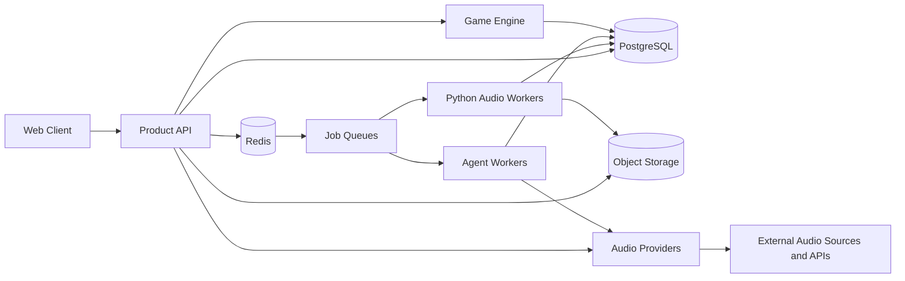
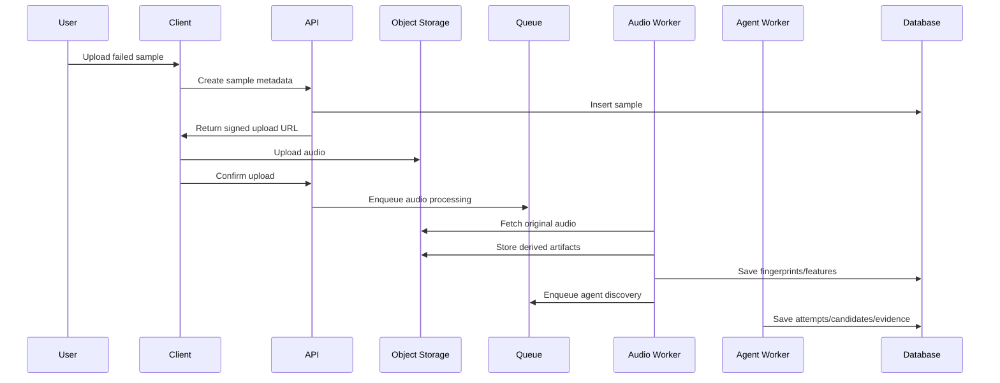
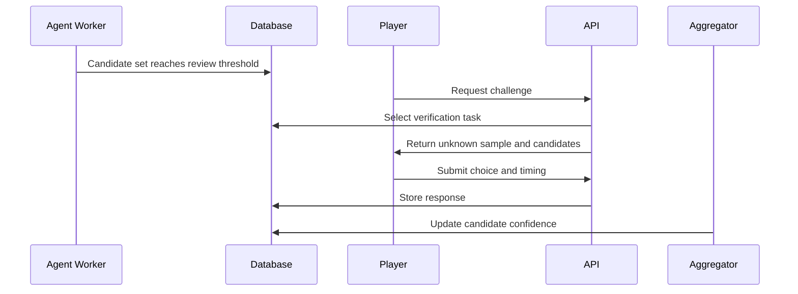

# Architecture

## High-Level System

## Service Boundaries

### Web Client

Responsibilities:

- Sample submission UI
- Game experience
- A/B verification screens
- Account and profile screens
- Admin/reviewer screens

The client should never directly expose private object storage URLs. It should request signed URLs from the API.

### Product API

Responsibilities:

- Authentication and authorization
- Sample lifecycle APIs
- Signed upload URL creation
- Audio provider search and URL resolution orchestration
- Game challenge generation
- Vote and response capture
- Candidate and verification reads
- Admin operations

The API should not perform heavy audio processing in request handlers.

### Audio Workers

Responsibilities:

- Validate audio files
- Normalize loudness and format
- Trim silence
- Generate previews
- Extract fingerprints and features
- Write quality metrics

Workers should be idempotent. Re-running a job should update or replace derived artifacts without duplicating logical records.

### Audio Providers

Responsibilities:

- Search or resolve source-specific audio catalogs
- Normalize provider metadata into internal track records
- Report playback capabilities such as seek, preview URL, bitrate, cache policy, and attribution needs
- Generate or validate 10-second playable windows
- Keep provider credentials and tokens server-side
- Degrade gracefully when a provider is unavailable or uncredentialed

SoundCloud is one provider. The game should also support manually seeded URLs, commerce previews, open-licensed catalogs, and direct uploads.

### Agent Workers

Responsibilities:

- Execute candidate discovery strategies
- Compare unknown samples to known tracks
- Search external metadata sources
- Cluster similar unknown samples
- Score and explain candidates
- Request human verification when useful

Agents write evidence, not just final guesses.

### Game Engine

Responsibilities:

- Select challenges
- Pick plausible distractors
- Control difficulty
- Record answers and response timing
- Estimate player expertise
- Route uncertain samples to qualified users

This can start as application logic inside the API and become its own service later.

## Data Flow: Sample Ingestion

## Data Flow: Human Verification

## Environments

### Local

- Docker Compose
- Postgres
- Redis
- MinIO for S3-compatible storage
- API service
- Worker service
- Next.js dev server

### Staging

- Managed Postgres
- Managed Redis
- Real S3 bucket
- Production-like queue and worker topology
- Synthetic and licensed test audio only

### Production

- Separate API and worker autoscaling
- Private object storage
- CDN for approved previews
- Strict observability
- Audit logging
- Abuse and takedown process

## Operational Requirements

- Every agent run must be traceable.
- Every candidate needs evidence and score history.
- Every human verification decision needs enough metadata to audit.
- Every provider-sourced track needs provider capability and rights metadata.
- Audio processing must tolerate retries.
- External API failures must degrade gracefully.
- Sample visibility should default to private or limited until legal review policies are explicit.

## Scaling Notes

The first scaling bottleneck will likely be audio processing and embedding search, not web traffic. Keep workers horizontally scalable and store derived artifacts so expensive work is not repeated.
