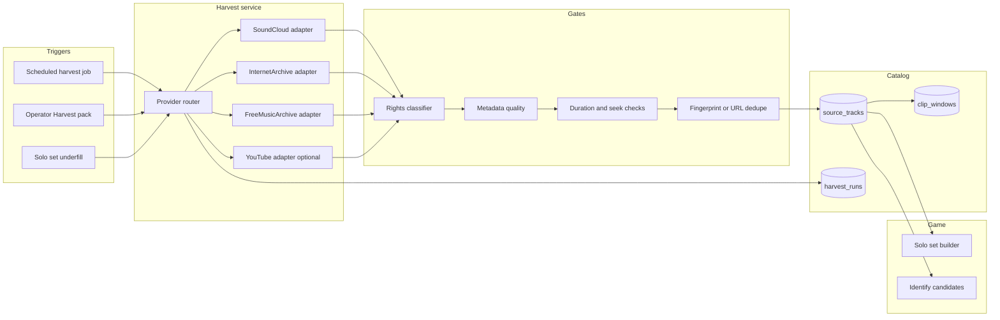

# Web Clip Sources — Design

Design for pulling **random, game-ready audio windows** from the web as solo / verification source material — without turning NameThatBeat into an unbounded music scraper.

This is complementary to curated seeds ([`solo_tracks.json`](../seeds/solo_tracks.json)) and the existing SoundCloud selection path. It is **not** a plan to download arbitrary YouTube/Spotify tracks.

## 1. Goal

Build a **Source Harvest Pipeline** that can:

1. Discover candidate tracks from allowlisted web providers.
2. Filter them for playability, duration, metadata quality, and **rights eligibility**.
3. Sample random non-overlapping **clip windows** (2–10s game exposures).
4. Promote survivors into the game catalog as `rights_status`-tagged source material.
5. Feed solo sets and (later) distractor pools / verification candidates.

Success metric for v1: operators can press “Harvest pack” and get **N new playable catalog entries** with attribution, window plans, and an audit trail — without manual URL pasting for every track.

## 2. Non-goals

- Scraping DRM’d services or private app data.
- Bulk downloading full commercial tracks for redistribution.
- Claiming fair use as a blanket license for public gameplay.
- “Random internet radio” with no provenance.

## 3. Rights model (hard gate)

Every harvested item must carry an explicit rights tier before it can enter public gameplay:

| Tier | Meaning | Public solo game | Internal testing | Notes |
|---|---|---|---|---|
| `public_domain` | PD / expired copyright (jurisdiction-aware) | Yes | Yes | Prefer Internet Archive, IMSLP-linked recordings with clear PD marks |
| `cc_by` / `cc_by_sa` | Creative Commons allowing reuse | Yes (with attribution) | Yes | Store license URL + required credit |
| `cc_nc` / `cc_nd` | Restricted CC | No (public) | Yes (local only) | Do not ship in public rounds |
| `provider_stream_ok` | Stream-in-place via provider widget under ToS | Maybe | Yes | SoundCloud-class: play via embed, do not cache audio |
| `preview_licensed` | Explicit preview license from partner/store | Yes if license says so | Yes | Future commercial path |
| `unknown` / `blocked` | Missing or hostile terms | No | No | Discard or quarantine |

**Rule:** random harvest only samples from pools that are already mapped to a tier. Randomness is *within* an allowlist, never across the open web.

## 4. Architecture



### Components

1. **Provider adapters** (extends [`AUDIOSOURCES.md`](AUDIOSOURCES.md) contract)
2. **Harvest orchestrator** (BullMQ job later; Next.js route + `.local` queue for MVP)
3. **Rights classifier** (license field + denylist + manual override)
4. **Window sampler** (random start offsets with non-overlap rules from [`AUDIO_SOURCES.md`](AUDIO_SOURCES.md))
5. **Catalog writer** (seed JSON today → Postgres `source_tracks` later)

## 5. Provider strategy (phased)

### Phase A — Safe random pools (implement first)

| Provider | Discovery | Playback | Randomness | Rights |
|---|---|---|---|---|
| **Internet Archive** | API search by collection/subject | Direct stream URL or derived MP3 | Shuffle search hits | Prefer items with `licenseurl` PD/CC |
| **Free Music Archive / CC hosts** | Genre/tag API or curated dump | Stream or short derived clip | Shuffle within license filter | CC only |
| **SoundCloud** (existing) | Authenticated search by genre/tag | Widget seek (no download) | Shuffle eligible playable tracks | `provider_stream_ok` only |

These three cover “random clips off the web” with provenance.

### Phase B — Broader discovery (optional)

| Provider | Use | Caution |
|---|---|---|
| **YouTube** | Search + iframe clip windows for **PD/CC channels only** allowlist | ToS + Content ID; never bulk-download |
| **Jamendo** | CC catalog API | Good structured licenses |
| **Wikimedia Commons** | Audio file search | Mixed quality; check license templates |

### Phase C — Do not use as random game fill

- Spotify / Apple Music / Amazon previews without a contract
- TikTok / Instagram scraping
- Peer-to-peer or “free MP3” sites
- Any source that forbids game/interactive use

## 6. Harvest request shape

Operator or job submits:

```json
{
  "run_id": "harvest_2026_07_20_001",
  "genre": "classical",
  "difficulty": "easy",
  "count": 20,
  "providers": ["internet_archive", "soundcloud"],
  "rights_allow": ["public_domain", "cc_by", "cc_by_sa", "provider_stream_ok"],
  "min_duration_seconds": 60,
  "max_duration_seconds": 900,
  "windows_per_track": 6,
  "window_seconds": 10,
  "query_boosts": ["orchestra", "symphony", "public domain"]
}
```

## 7. Clip selection algorithm

For each accepted source track:

1. Compute safe start range: `[lead_in, duration - window - lead_out]`  
   Defaults: `lead_in = 10s`, `lead_out = 10s` (avoid intros/silence/credits when possible).
2. Draw `windows_per_track` starts with:
   - uniform random in range, or
   - stratified (early / mid / late thirds) for better recognition variety.
3. Enforce minimum gap between windows (e.g. ≥ 10s) and no overlap.
4. Persist windows as metadata; **do not** slice/store audio unless tier allows transform (`public_domain` / some CC).
5. For `provider_stream_ok`, store only `{ source_url, start_seconds, duration_seconds }`.

Pseudo:

```text
candidates = provider.search(query, limit=50)
eligible = filter(candidates, rights + duration + has_stream + has_title_artist)
picked = shuffle(eligible).take(count)
for track in picked:
  windows = sample_windows(track.duration, n=6, size=10)
  upsert_source_track(track, windows, harvest_run_id)
```

## 8. Data model (catalog extension)

```text
source_tracks
  id
  provider
  provider_track_id
  source_url
  title
  artist_name
  genre
  duration_seconds
  rights_status
  license_url
  attribution_text
  playback_method          # widget_seek | direct_stream | derived_clip
  harvest_run_id
  quality_score            # metadata completeness + bitrate proxy
  status                   # candidate | approved | rejected | takedown

clip_windows
  id
  source_track_id
  start_seconds
  duration_seconds
  purpose                  # solo_game | verify_preview | internal
  use_count

harvest_runs
  id
  params_json
  started_at / finished_at
  fetched / accepted / rejected counts
  error_log
```

MVP without Postgres: write harvest output to  
`seeds/harvested/{run_id}.json` and optionally merge into a `solo_tracks` overlay file.

## 9. Integration with today’s game

### Solo set builder

Extend [`build-solo-set.ts`](../src/lib/catalog/build-solo-set.ts):

1. Prefer curated seeds with approved URLs.
2. If underfilled, pull from **approved harvested** tracks for that genre.
3. Keep SoundCloud live resolve as last resort (current behavior), but mark `discoverySource: "harvest"` vs `"seed_search"`.

### Identify unknown

Harvested CC/PD tracks become stronger A/B candidates than random live search, because rights and labels are cleaner.

### Random daily pack (product surface)

- “Daily scramble”: each day harvest or freeze a pack of 20 windows.
- Players get a stable pack (seeded RNG by date) so leaderboards stay fair.

## 10. MVP implementation plan (engineering)

### Slice 1 — Harvest adapter skeleton — **Done**

- `src/lib/providers/types.ts` — shared provider result type.
- `src/lib/providers/internet-archive.ts` — search + license parse + stream URL.
- `src/lib/harvest/run-harvest.ts` — orchestrator + active catalog merge.
- `POST /api/harvest/run` — writes `.local/harvest/{run_id}.json` and `active.json`.
- HTML5 stream playback via `use-clip-player` for non-SoundCloud sources.
- Operator UI: **Harvest clips** tab in the app shell.

### Slice 2 — Window sampler + catalog merge (1 day)

- Reuse `buildGeneratedWindows` / non-overlap helpers.
- Merge accepted rows into `seeds/harvested_active.json` loaded by `load-catalog.ts`.
- Solo builder reads harvested tracks with `audio_source_status: source_url_available`.

### Slice 3 — SoundCloud harvest mode (0.5–1 day)

- Wrap existing search as `SoundCloudHarvestProvider` with rights tier `provider_stream_ok`.
- Same random pick + window metadata; still widget playback only.

### Slice 4 — Safety rails (ongoing)

- Per-provider rate limits + caching of search responses.
- Denylist of uploaders / collections.
- Takedown flag flips `status=takedown` and removes from set builder immediately.
- Audit log of every URL ever served in a public round.

## 11. Randomness and fairness

- Use a **seeded PRNG** for daily packs (`date + genre`).
- Use unseeded shuffle for operator “surprise pack.”
- Never reuse the same `source_url + window` for the same player until cooldown ([`AUDIO_SOURCES.md`](AUDIO_SOURCES.md) localStorage rule stays client-side; server should also track `use_count` later).

## 12. Abuse and quality filters

Reject if:

- Duration &lt; 45s or &gt; 20 minutes (configurable).
- Title is empty, “track 1”, or pure URL spam.
- License missing when provider is CC/PD-oriented.
- Stream URL returns non-audio / geo-blocked (probe HEAD/GET range).
- Duplicate fingerprint or identical permalink already in catalog.

Optional quality score:

```text
quality = 0.4*has_artist + 0.3*has_genre + 0.2*license_clear + 0.1*bitrate_ok
```

Only auto-approve `quality >= 0.7`; rest go to moderation queue.

## 13. Recommended default policy for NameThatBeat

**Public solo game fill order:**

1. Hand-approved seeds  
2. Harvested `public_domain` / `cc_by*`  
3. Harvested `provider_stream_ok` (SoundCloud widget)  
4. Live resolve (current) only to finish a set, with reduced-set confirm  

**Never auto-promote `unknown` rights into public rounds.**

## 14. Open decisions (product/legal)

1. Is SoundCloud `provider_stream_ok` allowed for *public* namethatbeat.com gameplay, or only logged-in beta?
2. Do we store any derived 10s files for PD/CC, or always stream?
3. Which jurisdictions define “public domain” for classical recordings (composition PD ≠ recording PD)?
4. Should harvested tracks be shown with visible attribution in the UI always, or only in credits?

Until counsel answers (1)–(3), implement Phase A with **PD/CC first**, SoundCloud harvest marked **beta/stream-only**, and no YouTube download path.

## 15. Summary

Pulling “random clips off the web” should mean:

> **Random sampling inside rights-allowlisted provider pools**, producing **URL + time-window source material** (and optional PD/CC derived clips), ingested into the catalog with full provenance.

That gives the game endless variety without betting the company on scraping the open internet.
